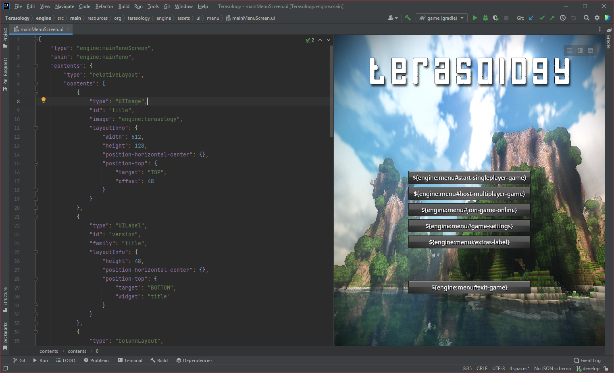

# NUI Editor Plugin

<!-- Plugin description -->
The NUI Editor plugin allows for previewing NUI UI layouts as they are being edited.
There is limited support for custom UI widgets from the same module or its dependencies.

## Features
- Live preview of NUI JSON layout files (`.ui`) as they are being edited.
- Custom NUI widgets found through the current module are automatically used where possible. 
<!-- Plugin description end -->

### Acknowledgements
- Some of the code here is derived from Terasology's [TeraNUI](https://github.com/MovingBlocks/TeraNUI) project, licensed under the [Apache License 2.0](https://www.apache.org/licenses/LICENSE-2.0).
- Some bitmap font code here is derived from the [Terasology](https://github.com/MovingBlocks/Terasology) project, licensed under the [Apache License 2.0](https://www.apache.org/licenses/LICENSE-2.0).
- Some NUI JSON loader code here is derived from the [Destination Sol](https://github.com/MovingBlocks/DestinationSol) project, licensed under the [Apache License 2.0](https://www.apache.org/licenses/LICENSE-2.0).
- The skeleton structure for this plugin is based on the [IntelliJ Platform Plugin Template](https://github.com/JetBrains/intellij-platform-plugin-template).
